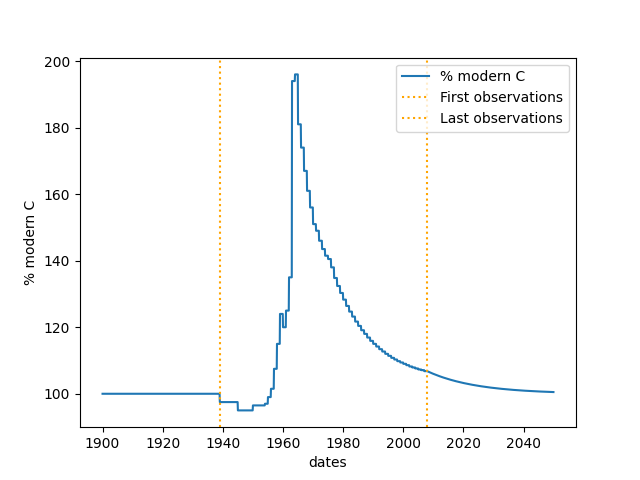

# Scientific Background

The RothC model splits soil organic carbon (SOC) into five distinct compartments, four active and one inert. The model accounts for soil type (clay content), temperature, moisture, and plant cover to calculate the decay rates of these pools.

* **DPM**: Decomposable Plant Material
* **RPM**: Resistant Plant Material
* **BIO**: Microbial Biomass
* **HUM**: Humified Organic Matter
* **IOM**: Inert Organic Matter

The decay follows first-order kinetics, where each active pool $i$ evolves according to:

$$
C_i(t) = C_{i,0} e^{-k_i \rho t}
$$

where $k$ is the decomposition constant and $\rho$ represents the combined rate-modifying factors.

## More detail

See the model description paper by the original code authors (Coleman, Prout and Milne, Rothamsted Research): [github.com/Rothamsted-Models/RothC_Py/RothC_description.pdf](https://github.com/Rothamsted-Models/RothC_Py/blob/main/RothC_description.pdf).

## Modern C curve

These values are used internally.
See Fig 5 in the original authors' description paper.

## References

* **Bolinder MA, et al. (2007).** An approach for estimating net primary productivity and annual carbon inputs to soil for common agricultural crops in Canada. *Agriculture, Ecosystems & Environment*, 118: 29-42.
* **Farina R, et al. (2013).** Modification of the RothC model for simulations of soil organic C dynamics in dryland regions. *Geoderma*, 200: 18-30.
* **Giongo V, et al. (2020).** Optimizing multifunctional agroecosystems in irrigated dryland agriculture to restore soil carbon - Experiments and modelling. *Science of the Total Environment*, 725.
* **Jenkinson DS. (1990).** The Turnover of Organic-Carbon and Nitrogen in Soil. *Philosophical Transactions of the Royal Society of London, Series B: Biological Sciences*, 329: 361-368.
* **Jenkinson DS, et al. (1987).** Modelling the turnover of organic matter in long-term experiments at Rothamsted. *INTECOL Bulletin*, 15: 1-8.
* **Jenkinson DS, Rayner JH. (1977).** Turnover of soil organic matter in some of the Rothamsted classical experiments. *Soil Science*, 123: 298-305.

